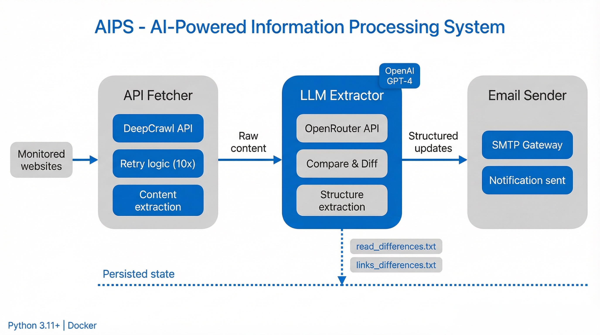

# AIPS - AI-Powered Information Processing System

<div align="center">
  
</div>

Automated website monitoring with LLM-based content extraction and email notifications.

## Table of Contents

- [Features](#features)
- [Quick Start](#quick-start)
  - [1. Setup Environment](#1-setup-environment)
  - [2. Configure URLs](#2-configure-urls)
  - [3. Run with Docker](#3-run-with-docker)
  - [4. Run Locally](#4-run-locally)
- [How It Works](#how-it-works)
- [File Structure](#file-structure)
- [Output Format](#output-format)
- [Docker](#docker)
  - [Docker Quick Start](#docker-quick-start)
  - [When to Rebuild](#when-to-rebuild)
  - [Docker Workflow](#docker-workflow)
  - [Common Docker Issues](#common-docker-issues)
  - [Advanced Docker Commands](#advanced-docker-commands)
- [Scheduling](#scheduling)
- [Configuration](#configuration)
  - [Change LLM Model](#change-llm-model)
  - [Adjust Retry Logic](#adjust-retry-logic)
  - [Minimum Size Validation](#minimum-size-validation)
- [Changelog](#changelog)
- [Requirements](#requirements)
- [License](#license)

## Features

- 🔍 Monitors websites for new content
- 📊 Compares changes using diff analysis
- 🤖 Extracts structured updates with LLM (via OpenRouter)
- 📧 Sends email notifications with titles and links
- 🐳 Docker-ready for easy deployment

## Quick Start

### 1. Setup Environment

Create `.env` file:
```bash
CLOUDFLARE_ACCOUNT_ID=your_cloudflare_account_id
CLOUDFLARE_API_TOKEN=your_cloudflare_api_token
OPENROUTER_API_KEY=your_openrouter_key
SMTP_SERVER=smtp.gmail.com
SMTP_PORT=587
SENDER_EMAIL=your_email@gmail.com
SENDER_PASSWORD=your_app_password
RECIPIENT_EMAIL=recipient@example.com
```

**Notes:**
- Get your Cloudflare Account ID and API token from [Cloudflare Dashboard](https://dash.cloudflare.com/). The token needs the **Browser Rendering** permission.
- For Gmail, use an [App Password](https://myaccount.google.com/apppasswords) instead of your regular password.

### 2. Configure URLs

Create `urls.json`:
```json
{
    "1": {
        "name": "IEEE JSAC",
        "url": "https://www.comsoc.org/publications/journals/ieee-jsac/cfp"
    },
    "2": {
        "name": "Google Research Blog",
        "url": "https://research.google/blog/"
    }
}
```

### 3. Run with Docker

**Option A: Run from project folder**
```bash
# Build the image
./build.sh

# Run the container
./run.sh
```

**Option B: Run from any folder**
```bash
# 1. Build once from AIPS project folder
cd /path/to/AIPS
./build.sh

# 2. Copy the runner script to your data folder
cp aips-run.sh /path/to/your/data/folder/

# 3. Run from your data folder (with your urls.json and venue folders)
cd /path/to/your/data/folder
./aips-run.sh
```

**Option C: Install as global command**
```bash
# 1. Build and install
cd /path/to/AIPS
./build.sh
./install.sh

# 2. Add to PATH (if needed)
echo 'export PATH="$HOME/.local/bin:$PATH"' >> ~/.bashrc
source ~/.bashrc

# 3. Use from anywhere
cd /any/folder/with/urls.json
aips
```

### 4. Run Locally

```bash
# Install dependencies
pip install -r requirements.txt

# Run
python main.py
```

## How It Works

1. **Fetch** — Downloads each URL as a Markdown snapshot using the [Cloudflare Browser Rendering API](https://developers.cloudflare.com/browser-rendering/)
2. **Save** — Writes the snapshot to `results_old.md` (first run) or `results_new.md` (subsequent runs)
3. **Compare** — Diffs old vs new snapshot; saves only the added lines to `differences.md`
4. **Extract** — LLM reads `differences.md` and identifies new articles/announcements, returning structured `(title, link)` pairs — noise, UI chrome, and self-referential links are discarded
5. **Email** — Sends a single combined notification with all updates across all monitored sources
6. **Cleanup** — Renames `results_new.md` → `results_old.md` to prepare for the next cycle

## File Structure

```
AIPS/
├── .env                    # API keys and email config
├── urls.json               # URLs to monitor
├── build.sh                # Build Docker image
├── run.sh                  # Run container (from project folder)
├── aips-run.sh             # Run container (from any folder)
├── install.sh              # Install as global command
├── uninstall.sh            # Uninstall global command
├── schedule.sh             # Schedule AIPS with cron
├── unschedule.sh           # Remove scheduled jobs
├── Dockerfile              # Docker image definition
├── docker-compose.yml      # Docker compose config
├── requirements.txt        # Python dependencies
├── main.py                 # Main application
├── api_fetcher.py          # Cloudflare fetch with retry logic
├── llm_extractor.py        # LLM extraction via OpenRouter
├── email_sender.py         # Email notifications
├── compare_results.py      # Diff generation
├── data_saver.py           # Saves Markdown snapshots
├── cleanup.py              # State management
└── venue_folder/           # Auto-created per URL
    ├── results_old.md      # Previous Markdown snapshot (baseline)
    ├── results_new.md      # Current Markdown snapshot (during run)
    ├── differences.md      # Added lines since last run (kept for history)
    └── extracted_updates.json  # LLM output (removed after run)
```

## Output Format

Each monitored URL gets a folder with:
- **results_old.md** — Previous Markdown snapshot (baseline for next comparison)
- **results_new.md** — Current snapshot (present only during a run)
- **differences.md** — Lines added since the last run (kept as history)

Email includes structured updates:
```
📰 2 New Updates from 2 Sources

📍 IEEE JSAC (1 update)
  1. New Call for Papers: Machine Learning
     🔗 https://example.com/article1

📍 Google Research (1 update)
  1. Introducing GIST: The Next Stage in Smart Sampling
     🔗 https://research.google/blog/gist
```

## Docker

### Docker Quick Start

```bash
./build.sh    # Build the image (once)
./run.sh      # Run the container (anytime)
```

### Running from Different Folders

Build the image once, then use it from any folder with its own `urls.json`:

```bash
# 1. Build image (one-time, from AIPS folder)
cd /home/user/AIPS
./build.sh

# 2. Copy runner to your data folder
cp aips-run.sh /home/user/project-monitoring/
cd /home/user/project-monitoring/

# 3. Create your urls.json here
# 4. Run AIPS - it will create venue folders here
./aips-run.sh
```

**Use cases:**
- Monitor different URL sets per project
- Separate monitoring for different teams/clients
- Keep project data organized in their own folders
- One Docker image, multiple data locations

### When to Rebuild

| Changed File | Need Rebuild? | Command |
|--------------|---------------|---------|
| `.env` | ✅ Yes | `./build.sh` |
| `urls.json` | ❌ No | `./run.sh` |
| `*.py` files | ✅ Yes | `./build.sh` |
| Venue folders | ❌ No | `./run.sh` |

### Docker Workflow

1. **Build** copies `.env` into Docker image
2. **Run** mounts current directory to `/data` in container
3. Container reads `urls.json` from mounted directory
4. Creates venue folders in mounted directory
5. Results accessible on your host machine

**Benefits:**
- `.env` file secured inside Docker image
- Data persists on your machine
- Clean isolated environment
- Easy deployment and scheduling

### Common Docker Issues

| Issue | Solution |
|-------|----------|
| "Docker image not found" | Run `./build.sh` first |
| "urls.json not found" | Ensure it's in current directory |
| "Permission denied" | Run `chmod +x build.sh run.sh` |
| Empty venue folders | Check if dependencies installed: `./build.sh` |

### Advanced Docker Commands

**View logs:**
```bash
docker-compose logs -f
```

**Stop container:**
```bash
docker-compose down
```

**Force rebuild (no cache):**
```bash
docker-compose build --no-cache
```

**Run in background:**
```bash
# Edit run.sh and change:
docker-compose up -d
```

**Enter container for debugging:**
```bash
docker-compose run --rm aips /bin/bash
```

## Scheduling

Run AIPS automatically at scheduled times using cron.

### Easy Scheduling (Recommended)

```bash
# Schedule AIPS for a specific folder
cd /path/to/AIPS
./schedule.sh /home/user/Desktop/AIPS 9 0    # Daily at 9:00 AM
./schedule.sh /home/user/project-a 14 30     # Daily at 2:30 PM
```

**Unschedule:**
```bash
./unschedule.sh /home/user/Desktop/AIPS      # Remove specific folder
./unschedule.sh                               # Remove all AIPS jobs
```

**Check logs:**
```bash
tail -f /home/user/Desktop/AIPS/aips.log
```

### Manual Cron Setup

```bash
crontab -e
# Add this line (runs daily at 9 AM):
0 9 * * * cd /home/user/Desktop/AIPS && aips >> /home/user/Desktop/AIPS/aips.log 2>&1
```

**Common schedules:**
```
0 9 * * *     # 9:00 AM daily
0 */6 * * *   # Every 6 hours
30 8 * * 1    # 8:30 AM every Monday
0 0 * * *     # Midnight daily
```

**View scheduled jobs:**
```bash
crontab -l
```

## Configuration

### Change LLM Model

Edit `llm_extractor.py`:
```python
model="openai/gpt-4o-mini"  # Change to your preferred model
```

Available models at: https://openrouter.ai/models

### Adjust Retry Logic

Edit `api_fetcher.py`:
```python
retries=10                        # Number of fetch attempts (default: 10)
backoff = random.uniform(2, 10)   # Normal retry delay range in seconds
backoff = random.uniform(5, 15)   # Rate-limit (429) retry delay range in seconds
```

### Minimum Size Validation

Edit `main.py`:
```python
min_ratio=0.5  # Accept if new data ≥ 50% of old size
```

This prevents accepting incomplete fetches that are significantly smaller than previous data.

## Changelog

### v2.0 — Cloudflare Browser Rendering
- **Replaced DeepCrawl API** with [Cloudflare Browser Rendering API](https://developers.cloudflare.com/browser-rendering/) for fetching pages
- Each URL is now fetched as a **single Markdown snapshot** instead of separate content and links files
- Per-source folder layout simplified: `results_old.md` / `results_new.md` / `differences.md` (replacing the four `.txt` files from v1.0)
- LLM extractor updated to work from a single diff rather than two separate diffs
- LLM system prompt significantly improved: explicit noise blocklist (cookie banners, dialogs, nav menus, etc.), semantic test ("would a subscriber want to be notified?"), and self-referential link filtering using the monitored URL
- Rate-limit handling improved: 429 responses back off 5–15 s separately from other errors; 2 s gap added between URLs
- `CLOUDFLARE_ACCOUNT_ID` and `CLOUDFLARE_API_TOKEN` added to `.env` / `env.template`

### v1.0 — DeepCrawl (baseline)
- Initial release using DeepCrawl API (`/read` and `/links` endpoints)
- Separate `read_results_old.txt`, `links_results_old.txt`, `read_differences.txt`, `links_differences.txt` per source
- LLM extracted titles from read diff and matched links from links diff

---

## Requirements

- Python 3.11+
- Docker (for containerized deployment)
- [Cloudflare account](https://dash.cloudflare.com/) with Browser Rendering API access
- [OpenRouter API key](https://openrouter.ai/keys)
- Email account with SMTP access

**Python packages:**
- requests
- pydantic
- openai
- python-dotenv

---

## Thank You 

Thank you for checking out AIPS! We hope this AI-powered information processing system makes automated website monitoring and content extraction easier for you. Feel free to fork the repository, try out your own improvements, and contribute. We welcome your feedback and collaboration—your suggestions and pull requests help make this project better for everyone.

**How you can contribute:**
- Add new website sources or improve URL handling
- Suggest or improve LLM extraction prompts or models
- Enhance email notification formatting or add delivery options
- Optimize diff analysis or content extraction logic
- Share bug reports, feature requests, or open issues

We look forward to seeing your ideas and contributions!
